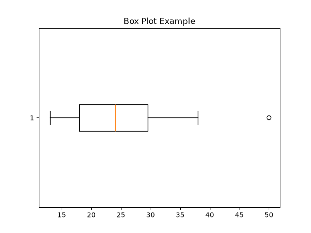

# Quartiles

Quartiles split **sorted** data into 4 equal parts.

* **Q1** — 25% of the data is below this value
* **Q2** — 50% of the data is below this value; this is the **median**
* **Q3** — 75% of the data is below this value

### Example

Data (already sorted):

```text
2, 4, 6, 8, 10, 12, 14, 16
```

#### Q2

The median is the middle of the whole dataset:

$$
Q2 = \frac{8 + 10}{2} = \mathbf{9}
$$

#### Q1

Q1 is the median of the lower half:

```text
2, 4, 6, 8
```

$$
Q1 = \frac{4 + 6}{2} = \mathbf{5}
$$

#### Q3

Q3 is the median of the upper half:

```text
10, 12, 14, 16
```

$$
Q3 = \frac{12 + 14}{2} = \mathbf{13}
$$

### Results

| Quartile |  Value |
| -------- | -----: |
| Q1       |  **5** |
| Q2       |  **9** |
| Q3       | **13** |

---

# Interquartile Range (IQR)

The **Interquartile Range (IQR)** measures the spread of the middle 50% of the data.

$$
IQR = Q3 - Q1
$$

For our example:

$$
IQR = 13 - 5 = \mathbf{8}
$$

### Why IQR Matters

IQR tells us how spread out the **middle 50%** of the data is.

Unlike the range (`maximum - minimum`), IQR is **not strongly affected by extreme values (outliers)**. This makes it useful for detecting potential outliers.

---

# Outlier Rule of Thumb

A common rule for identifying potential outliers uses **1.5 × IQR**.

### Lower

$$
Lower\ Bound = Q1 - 1.5 \times IQR
$$

### Upper

$$
Upper\ Bound = Q3 + 1.5 \times IQR
$$

Any value **below the lower bound** or **above the upper bound** is flagged as a potential outlier.

---

# Outlier Example

Consider the following data:

```text
2, 4, 6, 8, 10, 12, 14, 16, 50
```

Using the previously calculated values:

```text
Q1 = 5
Q3 = 13
IQR = 8
```

### Calculate the Bounds

```text
Lower = 5 - 1.5(8)
            = -7

Upper = 13 + 1.5(8)
            = 25
```

Therefore:

```text
Lower = -7
Upper = 25
```

The value `50` is above the upper bound:

```text
50 > 25
```

Therefore, **50 is an outlier**.

---

## Quick Summary

```text
Q1  → 25th percentile
Q2  → 50th percentile (Median)
Q3  → 75th percentile

IQR = Q3 - Q1

Lower Bound = Q1 - 1.5 × IQR
Upper Bound = Q3 + 1.5 × IQR
```

# Box Plot

 A **box-and-whisker plot** is a visual summary of a dataset's distribution. It uses five key values: **min, Q1,** **Median (Q2), Q3**, and **max.** The min and max shown by the whiskers are usually adjusted to exclude values identified as outliers.

---

## Example

Consider the following data:

```
16, 18, 28, 13, 50, 31, 25, 22, 18, 23, 29, 38
```

Using the IQR method:

```
Min                 = 13
Q1                  = 18
Median (Q2)         = 24
Q3                  = 30
Max                 = 38
Outlier             = 50
```

## Box Plot

```
                Q1    Median   Q3
                 |      |       |
   |-------------[======|=======]--------|        o
   13             18      24      30       38       50

   whisker      <--- box (IQR) --->    whisker    outlier
```

---

## Parts of a Box Plot

| Part | Meaning |
| --- | --- |
| **Box** | Spans from Q1 to Q3 — the middle 50% of the data |
| **Line inside box** | Represents the median |
| **Whiskers** | Extend to the minimum and maximum values within the 1.5 × IQR bounds |
| **Dots beyond whiskers** | Represent potential outliers |

---

## Why Box Plots Are Useful

A box plot allows you to understand several properties of a dataset at a glance:

- **Center**: represented by the median line
- **Spread:** represented by the box width (IQR)
- **Skew:**  can be identified when the median is not centered within the box or one whisker is much longer
- **Outliers:** shown as individual points beyond the whiskers

---

## Creating a Box Plot with Matplotlib

```python
import matplotlib.pyplot as plt

data = [2, 4, 6, 8, 10, 12, 14, 16, 50]

plt.boxplot(data, vert=False)
plt.title("Box Plot Example")
plt.show()
```

### Result



The resulting plot shows:

- The **box** between Q1 and Q3
- The **median** inside the box
- Whiskers extending to `13` and `38`
- A separate point at `50`, representing the outlier

---

## Quick Summary

```
Q1       → 25th percentile
Median   → 50th percentile
Q3       → 75th percentile

IQR      → Q3 - Q1

Box      → Q1 to Q3
Whiskers → outlier min/second max 38
Dots     → Outliers
```